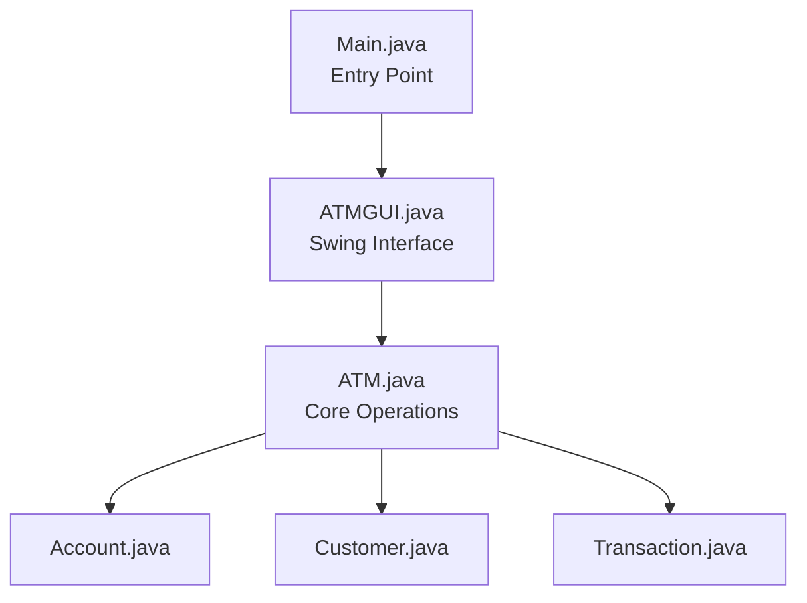
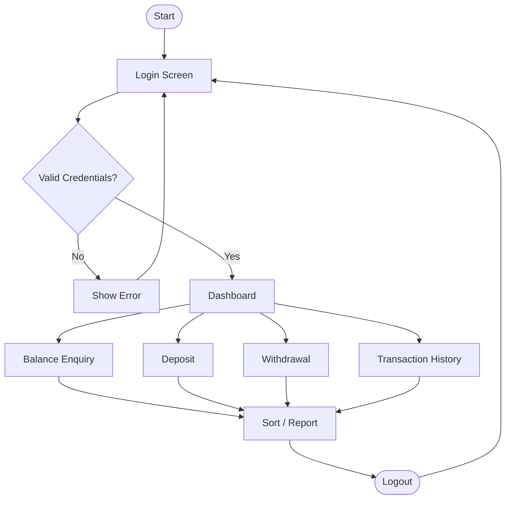

<div align="center">


</div>

---

## 📌 Overview

The **ATM Transaction Simulator** lets registered customers securely log in with an account number and PIN, then perform core banking operations — balance enquiry, deposits, withdrawals, mini statements, and more — through a desktop Swing GUI, all backed by Java's Collections Framework.

<div align="center">

| 🔐 Login & PIN Auth | 💰 Deposit / Withdraw | 🧾 Mini Statement | 🔎 Search & Sort | 📊 Reports |
|:---:|:---:|:---:|:---:|:---:|

</div>

---

## ✨ Features

- **Authentication** — Account number + 4-digit PIN, with validation for invalid entries
- **Balance Enquiry** — Instant view of account number and current balance
- **Deposit / Withdrawal** — Validated amounts, live balance updates, insufficient-balance protection
- **Mini Statement & History** — Full transaction log with date, type, and amount
- **Account Search** — O(1) lookup via `HashMap`
- **Account Sorting** — Auto-sorted account order via `TreeMap`
- **Transaction Sorting** — Sort by amount or date
- **Reports** — Total customers, total accounts, total bank balance, total transactions
- **Robust Validation** — Negative/zero amounts, bad input, invalid PINs all handled gracefully

---

## 🛠️ Tech Stack

| Technology | Role |
|---|---|
| **Java** | Core language |
| **Java Swing** | GUI (`JFrame`, `JPanel`, `JButton`, `JOptionPane`, etc.) |
| **ArrayList** | Customer records |
| **LinkedList** | Transaction history |
| **HashMap** | Fast account lookup |
| **TreeMap** | Sorted account records |
| **Java Time API** | Transaction timestamps |
| **Exceptions** | Input validation & error handling |

---

## 🏗️ Architecture



## 📁 Project Structure

```text
ATM-Transaction-Simulator/
└── src/
    ├── Main.java         # Entry point
    ├── ATM.java           # Core operations, search, reports
    ├── ATMGUI.java         # Swing dashboard
    ├── Account.java         # Balance, PIN, transactions
    ├── Customer.java         # Customer data
    └── Transaction.java       # Transaction record
```

---

## 📄 Class Responsibilities

| Class | Responsibility |
|---|---|
| `Main.java` | Bootstraps sample accounts/customers, launches GUI |
| `ATM.java` | Login, account management, search, sort, reports |
| `ATMGUI.java` | Login screen, dashboard, all user interactions |
| `Account.java` | Balance, PIN validation, deposit/withdraw, transaction history |
| `Customer.java` | ID, name, phone, linked account |
| `Transaction.java` | Type, amount, timestamp |

---

## 🔄 Workflow



---

## ▶️ Getting Started

```bash
# Check Java is installed
java -version && javac -version

# Clone & enter project
git clone <your-github-repository-url>
cd ATM-Transaction-Simulator/src

# Compile & run
javac *.java
java Main
```

---

## 🔑 Sample Test Accounts

| Account No. | PIN | Initial Balance |
|:---:|:---:|---:|
| `10001` | `1234` | ₹10,000 |
| `10002` | `5678` | ₹15,000 |
| `10003` | `4321` | ₹8,000 |

---

## 🧪 Testing Checklist

<table>
<tr>
<td valign="top">

**Login**
- ✅ Valid account + PIN
- ❌ Invalid account
- ❌ Wrong PIN
- ❌ Empty fields

</td>
<td valign="top">

**Deposit / Withdrawal**
- ✅ Valid amount
- ❌ Zero / negative amount
- ❌ Withdrawal > balance
- ❌ Non-numeric input

</td>
<td valign="top">

**Transactions**
- ✅ View history
- ✅ Sort by amount
- ✅ Sort by date
- ✅ Logout & re-login

</td>
</tr>
</table>

---

<div align="center">


## 👨‍💻 Author

**Pawan Mishra**
B.Tech Computer Science Engineering

**Karamveer Singh Qaumi**
B.Tech Computer Science Engineering

**SANJANA BASHYA Gundra**
B.Tech Computer Science Engineering

**Hemanshu Jivnani**
B.Tech Computer Science Engineering

*Developed as a Java Programming Mini Project to demonstrate OOP, Collections, Exception Handling, and GUI development.*

📜 Educational / Academic use only — not intended for real banking or financial use.

</div>
